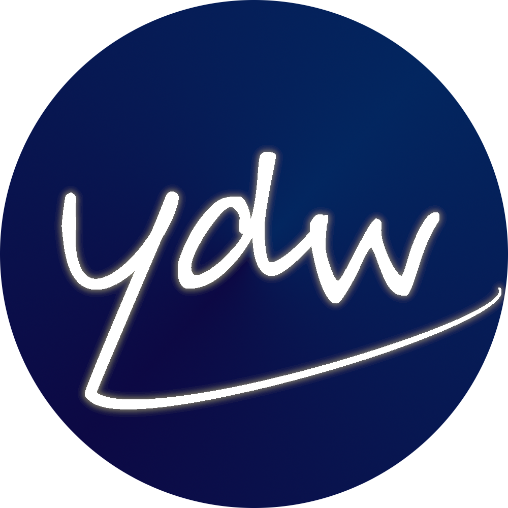

    
    <h1 align="center">
        Your Daily Word Android
    </h1>

## Table of Contents

- [Table of Contents](#table-of-contents)
- [Technologies Used](#technologies-used)
- [Screencaptures](#screencaptures)
	- [Dark Theme Example](#dark-theme-example)
	- [Edit Quote Example](#edit-quote-example)
	- [Add Quote Example](#add-quote-example)

## Technologies Used

<table>
<tbody>
    <tr align="center" valign="center">
        <td width="12%" align="center">
			
		</td>
        <td width="12%" align="center">
			
		</td>
        <td width="12%" align="center">
			
		</td>
        <td width="12%" align="center">
			
		</td>
        <td width="12%" align="center">
			
		</td>
        <td width="12%" align="center">
			
		</td>
        <td width="12%" align="center">
			
		</td>
        <td width="12%" align="center">
			
		</td>
    </tr>
    <tr align="center" valign="center">
 		<td width="12%" align="center">
			<a href="https://www.android.com/">
				<b>
					Android
				</b>
			</a>
		</td>
 		<td width="12%" align="center">
			<a href="https://developer.android.com/jetpack/compose">
				<b>
					Jetpack Compose
				</b>
			</a>
		</td>
 		<td width="12%" align="center">
			<a href="https://dagger.dev/hilt/">
				<b>
					Dagger Hilt
				</b>
			</a>
		</td>
 		<td width="12%" align="center">
			<a href="https://kotlinlang.org/docs/flow.html">
				<b>
					Kotlin Flows
				</b>
			</a>
		</td>
 		<td width="12%" align="center">
			<a href="https://protobuf.dev/">
				<b>
					Protocol Buffers
				</b>
			</a>
		</td>
 		<td width="12%" align="center">
			<a href="https://gradle.org/">
				<b>
					Gradle
				</b>
			</a>
		</td>
 		<td width="12%" align="center">
			<a href="https://kotlinlang.org/">
				<b>
					Kotlin
				</b>
			</a>
		</td>
 		<td width="12%" align="center">
			<a href="https://developer.android.com/studio">
				<b>
					Android Studio
				</b>
			</a>
		</td>
	</tr>
</tbody>
</table>

## Screencaptures

### Dark Theme Example

	

### Edit Quote Example

	

### Add Quote Example

	

